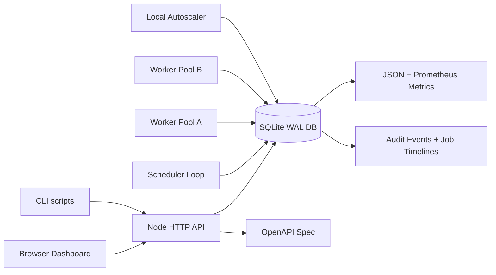

# Distributed Job Queue + Scheduler

Local-first distributed job queue and scheduler with durable SQLite storage, worker leases, configurable retries, dead-lettering, cron/interval schedules, DAG workflows, worker capability routing, rate limits, Prometheus-style metrics, REST APIs, live dashboard updates, and a browser dashboard.

## Demo

The recorded walkthrough is available at `artifacts/distributed-job-queue-demo.webm`. It covers queue setup, rate limits, job enqueue/cancel, schedules, workflows, failure injection, filtering, job details, timeline inspection, recovery, dead-letter replay, backup/import, and SQLite maintenance.

## Features

- Multiple named queues with priority-based dispatch.
- Durable SQLite persistence using Node's built-in `node:sqlite`.
- Queue-level concurrency enforcement across all workers.
- Queue pause/resume and max-backlog backpressure.
- Priority aging to reduce low-priority starvation.
- Queue and job-type dispatch rate limits.
- Worker capability routing for specialized workers.
- Worker leases with heartbeat renewal and stale lease recovery.
- Graceful worker draining with lease release after timeout.
- Per-job timeout handling with retry/dead-letter recovery.
- Per-job and per-queue retry policies with fixed/exponential backoff and jitter.
- DAG dependency cancellation when parent jobs fail permanently or are cancelled.
- Bulk dead-letter replay by queue/type.
- One-shot delayed jobs, recurring interval schedules, and 5-field cron schedules.
- DAG workflows where child jobs wait until parent jobs complete.
- Payload schema validation for known job types before enqueue.
- Per-job execution timelines backed by audit events.
- Runbook-style failure guidance for dead-lettered and failed jobs.
- Server-Sent Events for live dashboard updates.
- Prometheus-style `/metrics` endpoint.
- Local autoscaling recommendation API and worker autoscaler simulator.
- JSON snapshot export/import for reproducible demos.
- Dashboard demo scenario seeding and failure injection for timeout, retryable, permanent, rate-limit, and dependency failures.
- Job detail drawer with payload, output, retry policy, failure guidance, and per-job timeline.
- Throughput chart for completed vs dead-letter jobs.
- Worker pool view grouped by queue and capability.
- Idempotency dashboard showing duplicate submissions avoided.
- SQLite maintenance actions for vacuum, event pruning, and terminal-job archiving.
- API examples in `examples/`.
- OpenAPI specification at `/openapi.json`.
- Worker registry with last heartbeat, active leases, processed counts, and failure counts.
- REST API for queues, jobs, schedules, workflows, rate limits, backup/import, autoscaling, workers, metrics, and dead-letter replay.
- Browser dashboard for creating queues, enqueueing jobs, creating schedules, filtering/searching jobs, inspecting failures, exporting/importing state, and watching workers.
- CLI scripts for seeding, enqueueing, running workers, autoscaling workers, load testing, and running server + scheduler + workers together.
- Unit tests covering queue claiming, queue concurrency, retry/dead-letter behavior, cron scheduling, DAG release/cancellation, rate limits, capability routing, timeouts, backpressure, schema validation, scheduler due-time handling, stale lease recovery, API behavior, snapshot export/import, and worker execution.

## Architecture



## Run Locally

Install dependencies:

```bash
yarn install
```

Start the API and dashboard:

```bash
yarn dev
```

Open:

```text
http://localhost:4230
```

In another terminal, run a worker:

```bash
yarn worker
```

In another terminal, run the scheduler:

```bash
yarn scheduler
```

Or run everything together:

```bash
yarn local
```

Seed demo queues, jobs, and schedules:

```bash
yarn seed
```

Run tests:

```bash
yarn test
```

Run the local autoscaler simulator:

```bash
yarn autoscale
```

Run a local throughput test:

```bash
yarn load:test --jobs 1000 --workers 4 --concurrency 4
```

Run the browser E2E smoke test:

```bash
yarn test:e2e
```

The E2E script drives Chrome through the DevTools protocol when available and falls back to a dashboard asset/API smoke if Chrome cannot be controlled in the current environment.

## Useful Commands

Enqueue a job from CLI:

```bash
yarn enqueue --queue default --type email.digest --payload '{"userId":"u-123"}' --priority 5
```

Run two workers to demonstrate distributed leasing:

```bash
WORKER_ID=worker-a yarn worker
WORKER_ID=worker-b yarn worker
```

Run specialized workers to demonstrate capability routing:

```bash
WORKER_ID=webhook-worker WORKER_CAPABILITIES=webhook yarn worker
WORKER_ID=report-worker WORKER_CAPABILITIES=report,cache yarn worker
```

Use a custom database:

```bash
JOBQ_DB=data/demo.sqlite yarn local
```

Docker:

```bash
docker build -t distributed-job-queue-scheduler .
docker run --rm -p 4230:4230 -v "$PWD/data:/data" distributed-job-queue-scheduler
```

API examples:

```bash
curl -sS -X POST http://127.0.0.1:4230/api/jobs -H 'content-type: application/json' --data @examples/enqueue-job.json
curl -sS -X POST http://127.0.0.1:4230/api/workflows -H 'content-type: application/json' --data @examples/workflow-dag.json
curl -sS -X POST http://127.0.0.1:4230/api/failures/inject -H 'content-type: application/json' --data @examples/failure-injection.json
```

## REST API

- `GET /health` - service health and database path.
- `GET /api/state` - full dashboard state.
- `GET /api/metrics` - queue, job, worker, and schedule metrics.
- `GET /metrics` - Prometheus-style metrics.
- `GET /openapi.json` - OpenAPI specification.
- `GET /api/events/stream` - Server-Sent Events state stream.
- `POST /api/queues` - create or update a queue.
- `POST /api/queues/:queueName/toggle` - pause or resume queue dispatch.
- `GET /api/rate-limits` - list type/queue dispatch rate limits.
- `POST /api/rate-limits` - create or update a rate limit.
- `GET /api/autoscale/recommendation` - local worker scaling recommendation.
- `GET /api/charts/throughput` - completed/dead-letter throughput series.
- `GET /api/worker-pools` - worker capacity grouped by queue and capability.
- `GET /api/idempotency` - idempotency duplicate-submission stats.
- `POST /api/demo/seed` - seed a full demo scenario.
- `POST /api/failures/inject` - inject failure scenarios.
- `POST /api/maintenance/vacuum` - checkpoint and vacuum SQLite.
- `POST /api/maintenance/prune-events` - prune old events while keeping recent history.
- `POST /api/maintenance/archive-jobs` - archive old terminal jobs.
- `GET /api/export` - export a JSON snapshot.
- `POST /api/import` - import a JSON snapshot in merge or replace mode.
- `POST /api/jobs` - enqueue a job.
- `GET /api/jobs/:jobId/events` - per-job execution timeline.
- `POST /api/jobs/:jobId/cancel` - cancel a queued/scheduled/dependency-waiting job.
- `POST /api/jobs/:jobId/requeue` - requeue a failed, cancelled, completed, or dead-lettered job.
- `POST /api/dead-letter/replay` - replay dead-letter jobs by queue/type.
- `POST /api/schedules` - create a recurring schedule.
- `POST /api/schedules/:scheduleId/toggle` - pause or resume a schedule.
- `POST /api/schedules/:scheduleId/run-now` - enqueue one immediate job from a schedule.
- `POST /api/workflows` - create a DAG workflow from job definitions.

## Cron and Workflow Examples

Create a cron schedule from the dashboard or API:

```json
{
  "name": "Five minute heartbeat",
  "queue": "critical",
  "type": "webhook.deliver",
  "cronExpr": "*/5 * * * *",
  "timeoutMs": 5000,
  "requiredCapabilities": ["webhook"],
  "retryPolicy": { "strategy": "exponential", "baseMs": 2000, "maxDelayMs": 60000, "jitterMs": 500 },
  "payload": {
    "endpoint": "https://example.com/heartbeat"
  }
}
```

Create a small DAG:

```json
{
  "name": "ETL notification workflow",
  "jobs": [
    { "key": "extract", "queue": "bulk", "type": "report.generate", "requiredCapabilities": ["report"], "payload": { "reportId": "daily" } },
    { "key": "transform", "queue": "default", "type": "cache.warm", "requiredCapabilities": ["cache"], "dependsOn": ["extract"] },
    { "key": "notify", "queue": "critical", "type": "webhook.deliver", "requiredCapabilities": ["webhook"], "dependsOn": ["transform"] }
  ]
}
```

## Resume Bullets

```latex
\resumeItem{Built a SQLite-backed distributed job queue and scheduler with priority queues, delayed jobs, interval/cron schedules, DAG workflows, queue-level concurrency, backlog backpressure, rate limits, priority aging, worker leases, heartbeat renewal, graceful draining, stale lease recovery, configurable retry policies, timeout recovery, dead-letter replay, REST APIs, SSE live updates, and a local operations dashboard.}
\resumeItem{Implemented worker capability routing, dependency-failure propagation, runbook-style failure guidance, throughput charts, worker-pool/idempotency dashboards, OpenAPI docs, JSON backup/import, SQLite maintenance tools, autoscaling recommendations, a local worker autoscaler simulator, failure injection, browser E2E smoke testing, load testing, Docker/GitHub CI packaging, and unit tests to model production-grade asynchronous job orchestration without external infrastructure.}
```
